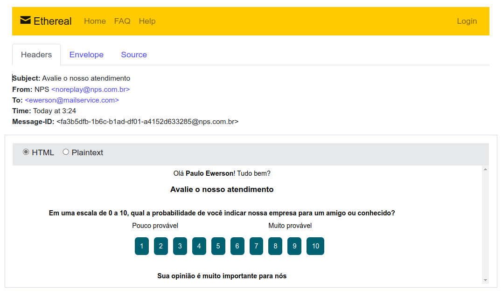

<h1 align="center">
    
    <br>
    Node.js
</h1>

<p align="center">
  
  
</p>

<p align="center">
  <a href="#bookmark-sobre">Sobre</a>&nbsp;&nbsp;&nbsp;|&nbsp;&nbsp;&nbsp;
  <a href="#gear-funcionalidades">Funcionalidades</a>&nbsp;&nbsp;&nbsp;|&nbsp;&nbsp;&nbsp;
  <a href="#rocket-tecnologias">Tecnologias</a>&nbsp;&nbsp;&nbsp;|&nbsp;&nbsp;&nbsp;
  <a href="#boom-como-executar">Como Executar</a>&nbsp;&nbsp;&nbsp;|&nbsp;&nbsp;&nbsp;
  <a href="#lock-variáveis-de-ambiente">Variáveis de Ambiente</a>&nbsp;&nbsp;&nbsp;|&nbsp;&nbsp;&nbsp;
  <a href="#scientist-rodando-os-testes">Rodando os Testes</a>&nbsp;&nbsp;&nbsp;|&nbsp;&nbsp;&nbsp;
  <a href="#memo-licença">Licença</a>
</p>

<p align="center">
  
<p>

## :bookmark: Sobre

O **npsMail** é uma aplicação que consiste em calcular o [NPS](https://pt.wikipedia.org/wiki/Net_Promoter_Score) da empresa, esenvolvido durante a trilha de NodeJS, na quarta edição da NLW. Aprendemos conceitos sobre o que é um API, como iniciar um projeto utilizando Typescript e Express para gerenciamento das rotas, TypeORM para manipulação dos dados, testes automatizados e envio de e-mail.

## :gear: Funcionalidades

- Cadastro de usuários
- Cadastro de pesquisas
- Envio de e-mail

## :rocket: Tecnologias

- [TypeScript](https://www.typescriptlang.org/)
- [Ethereal-Email](https://ethereal.email/)
- [TypeORM](https://typeorm.io/#/)
- [Express](https://expressjs.com/pt-br/)
- [Jest](https://jestjs.io/)
- [SQL Editor Beekeeper Studio](https://www.beekeeperstudio.io/)

## :boom: Como Executar

- ### **Pré-requisitos**

  - É **necessário** possuir o **[Node.js](https://nodejs.org/en/)** instalado no computador
  - É **necessário** possuir o **[Git](https://git-scm.com/)** instalado e configurado no computador
  - Também, é **necessário** ter um gerenciador de pacotes seja o **[NPM](https://www.npmjs.com/)** ou **[Yarn](https://yarnpkg.com/)**.
  
1. Clone o repositório:

```sh
  $ git clone https://github.com/PauloEwerson/npsMail.git
```
    
2. Entre no diretório do projeto

```bash
  cd npsMail
```

3. Execute a aplicação:

```sh
  # Instalando as dependências do projeto.
  $ yarn # ou npm install
  
  # Configurando o banco de dados e criando as tabelas.
  $ yarn migration:run # ou npm run migration:run

  # Inicie a API (modo de desenvolvimento)
  $ yarn dev # ou npm run dev
```
    
## :lock: Variáveis de Ambiente

Para rodar esse projeto, você vai precisar adicionar as seguintes variáveis de ambiente no seu .env

`NODE_ENV=development`
`API_PORT=3333`
`URL_MAIL=http://localhost:3333/answers`

## :scientist: Rodando os Testes

Para rodar os testes, execute o seguinte comando

```bash
  $ yarn test # ou npm run test
```

## :memo: Licença

Esse projeto está sob a licença MIT. Veja o arquivo [LICENSE](LICENSE.md) para mais detalhes.

---
<sup>Projeto desenvolvido com a tutoria de [Diego Fernandes](https://github.com/diego3g), CTO [Rocketseat](rocketseat.com.br).</sup>
